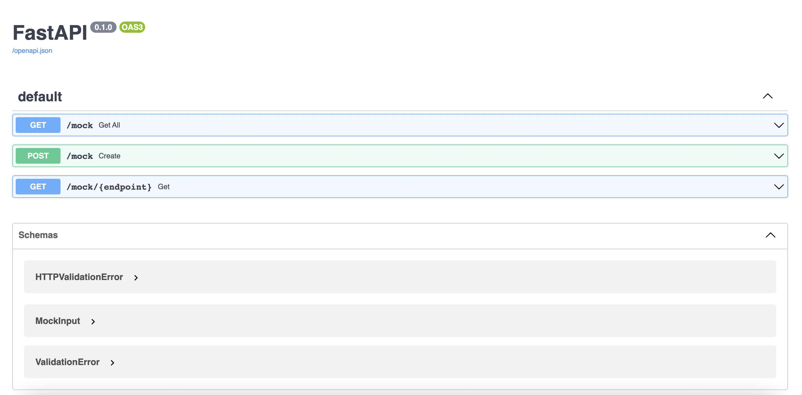
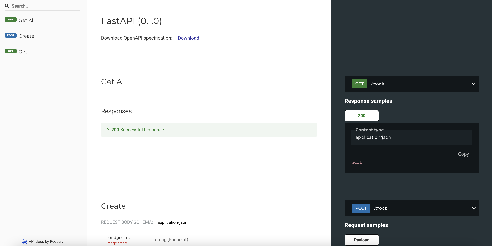

# Fast GPT Mock

Create your mocks to retrieve generated data with GPT model text-davinci-003 through natural language. This project was created with Python and FastAPI.


## Endpoints

- GET /mock -> Retrieve all the created mocks.
- POST /mock -> Create your mock through a prompt
- GET /mock/{your_endpoint} -> Get your generated data


## Installation

Fast GPT Mock requires Python v3.9+ to run.

Install the dependencies.

```sh
cd fast-gpt-mock
pipenv install
```

Activate your virtual env.

```sh
pipenv shell
```

## Execution

Copy the .env-example file

```sh
cp .env-example .env
```

Set your environment variables

| Variable | Description |
| ------ | ------ |
| DB_CONNECTION_STRING* | Database connection string compatible with SQLAlchemy |
| GPT_API_KEY | OpenAI Apikey |

*You can use sqlite, setting: "sqlite:///./database.sqlite"

Start the app

```sh
uvicorn main:app
```

It will run in http://127.0.0.1:8000


## Swagger & Redoc
FastAPI is integrated with Swagger and Redoc. You can view this in

http://127.0.0.1:8000/docs




http://127.0.0.1:8000/redoc




## License

MIT

**Free Software, Yeah!**

